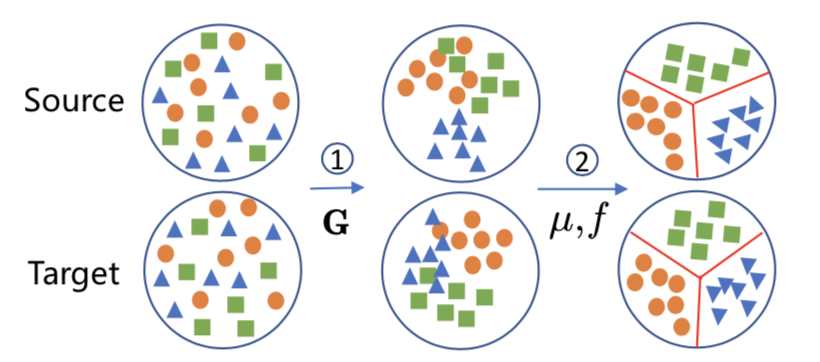
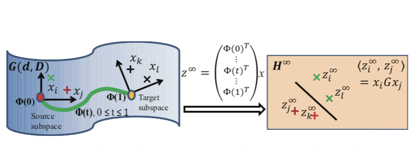
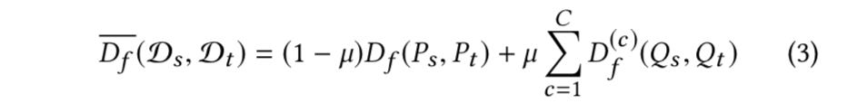
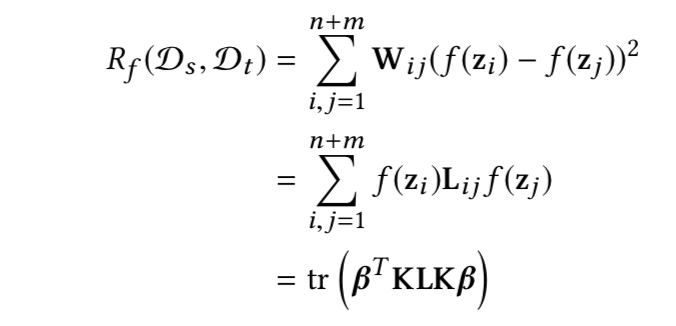
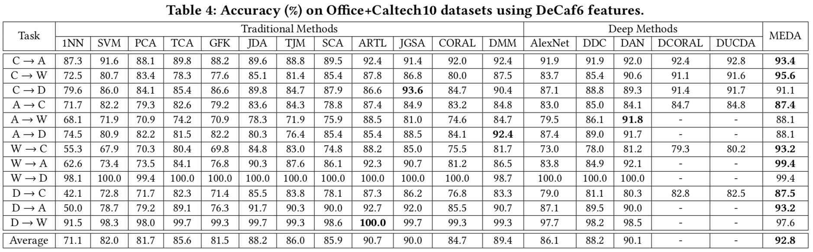
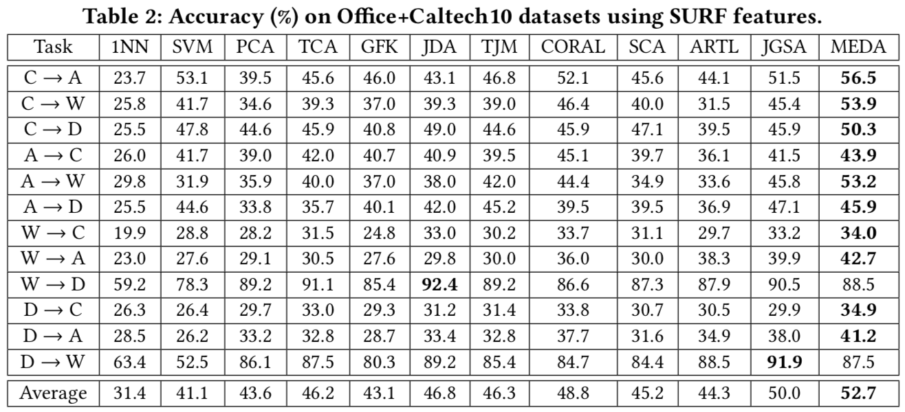
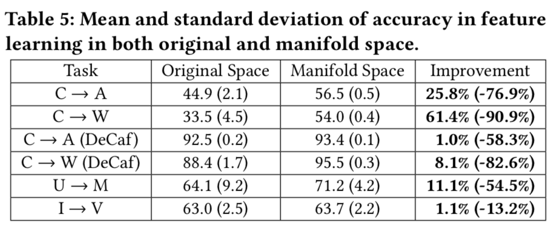
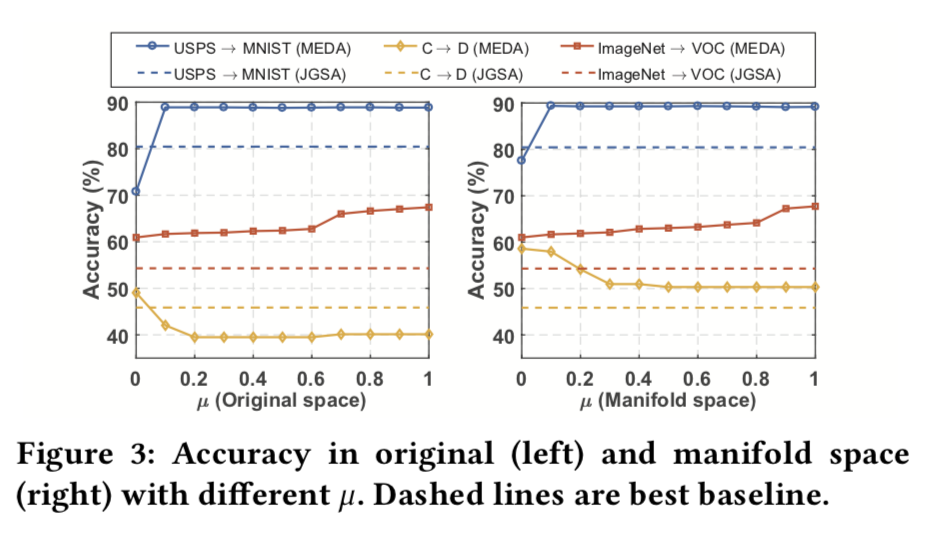
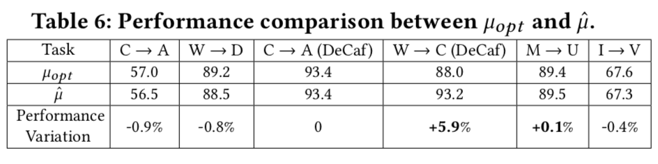

# [Visual Domain Adaptation with Manifold Embedded Distribution Alignment](../Reading_papers/ACM_MM_2018_Visual&#32;Domain&#32;Adaptation&#32;with&#32;Manifold&#32;Embedded&#32;Distribution&#32;Alignment.pdf)

## 概述

流形嵌入分布对齐(MEDA)是基于之前的ARTL进行了改进，他指出了以前Domain Adaptation里没有解决的问题：

1. degenerated feature transformation: 

    - 在原特征空间进行分布对齐的操作时会有特征扭曲的现象发生
    
    - 子空间学习只利用了流形空间的结构，没有进行特征对齐
     
    这两个操作只能减少分布的差异，而不能完全移除差异

2. unevaluated distribution alignment: 

    在进行分布对齐时把边缘分布和条件分布看的同样重要(类似于JDA)

这篇论文基于ARTL对以上两点问题做了对应的改进：

1. 在格拉斯曼流形空间中通过结构风险最小化原则学习一个分类器

    - 原始空间中特征往往会出现扭曲，因此会使得学习结果欠适配。
    
    - 流形假设里，流形空间中的点和他们的邻居通常性质相似，因此作者希望将原始数据空间嵌入到一个流形空间中，再进行Domain Adaptation，最后学得一个分类器

2. 对于边缘分布和条件分布，给予他们不同的重要性(与BDA一样，添加一个系数$\mu$)，但是与BDA不同的是，他给出了一个量化这两者重要性的度量（Dynamic Distribution Alignment）

## MEDA

MEDA算法可以大致上分为两步:

1. 流形特征学习:将数据从原来的特征空间变换到GrassMann流形空间上，让相近的数据有相似的性质

2. 动态分布对齐:通过特定的方法学习$\mu$，然后在结构风险最小化框架下学习分类器$f$

分类器$f$的表达式：

$$f=\underset{f\in\sum^n _{i=1}}{arg\,min}\quad l(f(g(x_i)),y_i)+η||f||^2_K +λ\overline{D_f}(D_s,D_t)+ρR_f (D_s,D_t)$$

他与ARTL中的优化公式很像：

$$f=\underset{f\in\sum^n _{i=1}}{arg\,min}\quad l(f(x_i),y_i)+η||f||^2_K +λD_f(D_s,D_t)+ρR_f(D_s,D_t)$$

 

$l(f(x_i),y_i)$: 损失函数，MEDA里面把$g(\,)$作为流形特征学习的公式

$||f||^2_K$: 结构正则化项

$D_f(D_s,D_t)$: 联合分布正则项

$R_f(D_s,D_t)$: 流形正则项

#### 两个公式里面不同点就在于MEDA多了流形特征学习(Manifold Feature Learning)和动态分布对齐(Dynamic Distribution Alignment)

## 流形特征学习(Manifold Feature Learning)

MEDA在Grassmann流形里面使用[*Geodesic Flow Kernel (GFK)*](./GFK.md)的方法去将源域和目标域的差异拉近

### GKF的思想：

设$G(d,D)$是数据$D$的原始空间在$d$维子空间的全部集合(GrassMann流形)，那么任意一个数据D的d维子空间就是G上的一个点，两点之间的测地线可以在两个子空间之间构成一条路径，从一个点通过测地线走到另一个点可以看成从一个空间迁移到另一个空间

定义Φ是流形空间G中的测地线

令 Ss=Φ(0) ，St=Φ(1) （源域和目标域经过PCA降维后的子空间的基）

则寻找一条从 Φ(0) 到 Φ(1) 的测地线就等同于将原始的特征变换到一个无穷维度的空间中，最终减小域之间的漂移现象，可以看作从Φ(0)一步一步的走到Φ(1)

在流形空间中的特征可以表示成$z=\Phi(t)^Tx$，那么$x_i,x_j$变换之后的特征$z_i,z_j$的内积定义了一个半正定的测地核

可以得到$z=\sqrt{G}x$

G的平方根的求解使用Denman-Beavers算法

## 动态分布对齐(Dynamic Distribution Alignment)

动态分布对齐是用一种量化的形式去评估边缘分布和条件分布的重要性，与BDA一样，他在条件分布和边缘分布项之间加了一个参数$\mu$

与BDA不同的是，他用了一种定量的方法去估计$\mu$的最优解

## 他使用了$A-distance$作为基本度量

首先设$\epsilon(h)$是一个线性分类器区分源域和目标域数据的误差，则源域和目标域的$A-distance$被定义为：

$$d_A(D_s,D_t)=2(1-2\epsilon(h))$$

对于边缘分布，可以直接计算他们的$A-distance:d_M$

对于条件分布，可以通过分别计算他们每一类的$A-distance$，然后求和得到

$$d_C=\Sigma^C_{c=1} d_A(D^{(c)}_s,D^{(c)}_t)$$

然后$\mu$的估计值可以通过他们的比值得到

$$\hat{\mu}=1-\frac{d_M}{d_M+d_C}$$

$\beta$在每一次的迭代中都需要重新计算，因为每一次JDA迭代都会重新给目标域的数据打标签，所以$d_C$会变

## 分类器$f$的表达式求解

$f=\underset{f\in\sum^n _{i=1}}{arg\,min}\quad l(f(g(x_i)),y_i)+η||f||^2_K +λ\overline{D_f}(D_s,D_t)+ρR_f (D_s,D_t)$

#### 损失函数项
与ARRLS里面一样，$f$的损失函数用平方损失函数：

$l(f(g(x_i)),y_i)=\displaystyle \sum^{n}_{i=1}(f(z_i)-y)^2=\displaystyle \sum^{n+m}_{i=1}A_{ii}(f(z_i)-y)^2=||(Y-\beta^TK)A||^2$

$s.t.\ A_{ii} = 1\quad if\ i \in D_s ,\:otherwise\: Ai i = 0$

#### 结构正则化项：

由表示定理可知：

$f(z)= \displaystyle \sum^{n+m}_{i=1}β_iK(z_i,z)$

所以

$η||f||^2_K=η||\beta K||^2_K=\eta\, tr(\beta^TK\beta)$

#### 分布正则化项：

$λ\overline{D_f}(D_s,D_t)=(1-\mu)P(z_s,z_t)+\mu Q(z_s,z_t)=tr (β^T KMKβ)$

#### 流形正则化项：

f的最终表达式

$f=\underset{f\in\sum^n _{i=1}}{arg\,min}\quad ||(Y-\beta^TK)A||^2+ηtr(\beta^TK\beta) +λtr (β^TKMKβ)+ρ\,tr(\beta^TKLK\beta)$

它是一个无约束的二次凸优化问题，对beta求导，零其导数=0，得到beta的解：

$β^* = ((A + λM + ρL)K + ηI)^{−1}AY^T$

## 实验

### 特征提取

DataSet | 提取方法 | 特征维数
-|-|-
USPS+MNIST | SURF | 256
Office+Caltech10 | SURF | 800
Office+Caltech10 | DeCaf6 | 4096
Office-31 | DeCaf6 | 4096
ImageNet+VOC | DeCaf6 | 4096 

### 参数
DataSet | 流形特征维数d |  Kernel | $p,\lambda,\eta,ρ$ | 迭代次数
-|-|-|-|-
Office+Caltech10 | 20 | RBF | 10, 10, 0.1, 1 | 10
USPS+MNIST | 30 | RBF | 10, 10, 0.1, 1 | 10
ImageNet+VOC  | 40 | RBF | 10, 10, 0.1, 1 | 10

### 结果

## 有效性分析

1. 流形特征学习：为了验证流形特征学习的有效性，作者在进行流形特征学习和不进行流形特征学习的情况下分别随机的选择任务进行试验：

准确性均值的提高可以表明对流形特征学习有助于减少分布差异

标准差的减少表明经过流形特征学习后相近的数据具有相似的性质

2. 动态分布对齐：作者先是用不同的$\mu$在相同的任务上进行试验，验证了对于边缘和条件分布加以不同重要性的正确性，同时通过实验可以看出$\mu$不同的任务,$\mu$的最优值是不一样的，同时作者将$\mu$的最优值$\mu_{opt}$和通过动态分布对齐计算出来的$\hat{\mu}$进行对比，发现这二者很接近，有时更是优于通过粗遍历得到的$\mu_{opt}$

## 总结

1. 这篇论文基于ARTL进行了两点改进：
   1. 将原始特征空间通过GFK的方法转换到GrassMann流形空间中，进一步减小了源域和目标域分布差异
   2. 通过给边缘分布和条件分布加以不同的参数，区别对待两者的重要性(思路来源于BDA，都是同一个作者)，并且给出了一个明确的公式来近似的估算$\mu$
