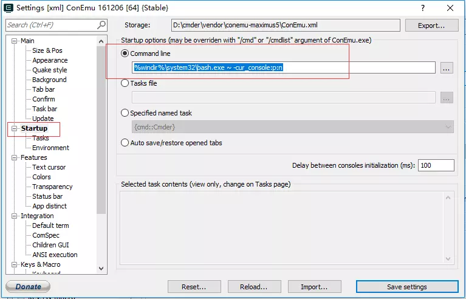

# 关于登陆服务器以及GPU的几个小建议

## 如何简化登陆服务器的步骤

### Mac端


1. 打开命令行输入：
```
    cd # 对，不加参数
    vi .bashrc # 用vi打开bashrc
    
    在某一空行添加如下代码：

    alias aliasname='ssh ip -l user'

    其中，aliasname是你起的别名,依据个人喜好自己定.ip是服务器ip（对于我们的gpu来说是114.212.87.44）。user是登录的用户（一般是iip，但是建议有空自己建一个user）

```

2. 保存退出（按esc键。然后输入 :wq 再按回车）

3. 退出后重启命令行或者输入：

        source .bashrc # 使更新过的 .bashrc 生效


进行以上操作之后，可以直接在命令行中输入你给ssh登录命令起的别名，再输入密码即可登录服务器

*以上是以bash为命令行时的情形，如果你是使用的```zsh```或者```fish```，则需要添加到相应的```.zshrc```或者```.fishrc```文件中*

#### Mac端的命令行工具强烈建议使用[iTerm2](https://www.iterm2.com/)，有各种让你意想不到的神奇功能，贴一个[链接](https://www.jianshu.com/p/9c3439cc3bdb)，打造舒适终端体验


----

### Windows端

Windows下的命令行工具强烈建议使用[Cmder](https://cmder.net)，他让你使用与linux下一样的命令操作计算机

下面的所有命令行操作默认是使用[Cmder](https://cmder.net)来完成的

1. 打开Cmder，进入bash(若已在bash里面则不需要重复进入)

        bash # 直接输入bash进入bash

2. 然后其余的步骤与Mac端保持一致，***设置完之后在cmder里面设置每次启动cmder默认从bash启动：***

        %windir%\system32\bash.exe ~ -cur_console:p:n

    



完成撒花🎉🎉🎉🎉🎉🎉🎉

----

## 如何免密登录服务器（Windows & Mac）

1. 在本地生成一个```ssh-key```（已经有了的可以不用重新生成）:

        打开命令行，输入:

        ssh-keygen

2. 然后一路回车，生成```ssh-key```

3. 生成的```ssh-key```保存在当前的文件夹下一个叫做 .ssh 的文件夹，我们进去打开公钥：

        cd .ssh
        vi .id_rsa.pub # 这是默认的公钥名称，如果你在生成的时候指定了别的名称，请自行修改命令

4. 打开公钥以后将公钥全部复制出来，然后登录服务器

5. 登录后，进到服务器的ssh文件夹下（如果服务器的登录目录上没有sshkey则根据上述命令生成一个）
    
        cd .ssh
        vi authorized_keys # 如果没有这个文件就创建一个

6. 然后将你在第4步复制的公钥粘贴进这个文件里面，注意如果已经有别人的公钥了就粘贴在他们下面一行，不要把别人的覆盖掉，粘贴好后保存退出

    这样就可以免密登录服务器了


### *Note: If anything wrong, please feel free to contanct Caoyikang*